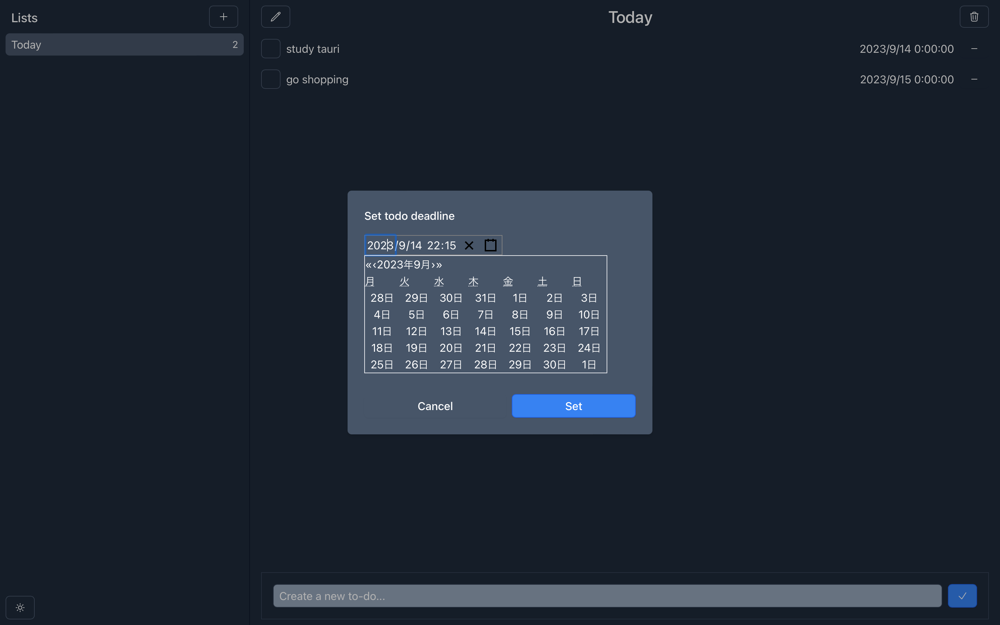
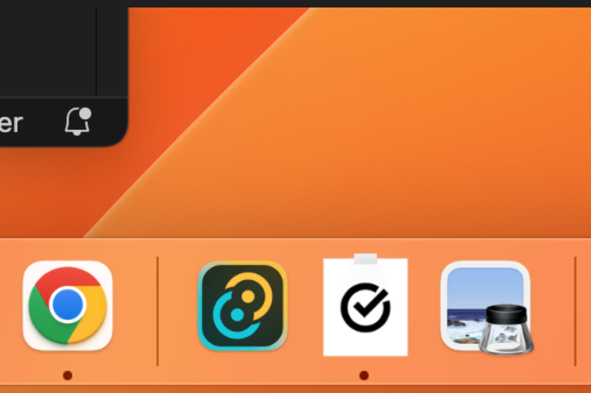

# ToDo Desktop App

ToDo Desktop App is a simple task management application. This app allows you to create ToDo lists, add ToDo items, set deadlines for them, and receive desktop notifications when deadlines are reached.

## Key Features

- Create ToDo lists
- Create ToDo items
- Set deadlines for ToDo items
- Receive desktop notifications when deadlines are reached

## Screenshots

- Choose dates and times with a calendar
  
- Receive notifications in the background
  

## Download

You can download this application from the following link:

- [Download for macOS (DMG)](https://github.com/taiyou1116/tauri-todo-app-practice/releases/tag/v1.0.0)

## Installation

Once you've downloaded the application, follow these steps to install it:

1. Double-click the downloaded DMG file to mount it.
2. Inside the mounted disk image, drag and drop the application into the "Applications" folder.
3. Once the application is copied to the "Applications" folder, you can launch it from Finder.

## Usage

When you launch the application, you can create ToDo lists, add ToDo items, and set deadlines. Desktop notifications will be displayed when deadlines are reached.
